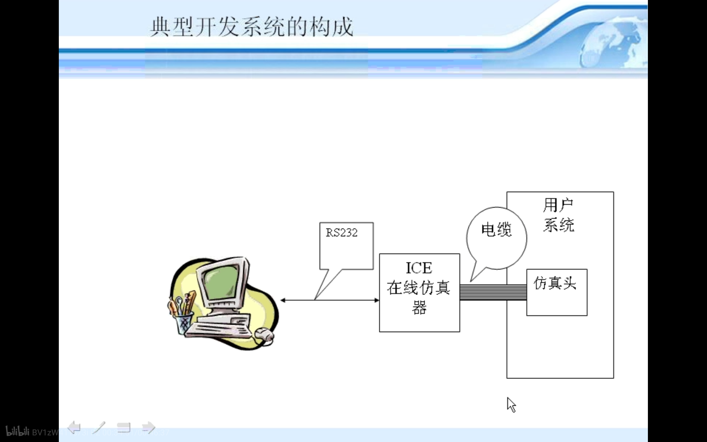

# 单片机课程学习
## 什么是单片机
单片机是微型计算机的一种特殊情况，单片机包括CPU RAM ROM 计数 串行 I/O,又称MCU，EMCU。 
单片机与普通PC的不同在于 单片机将各个模块集成。
* **通用性** 任意产品 51便属于这种
* **专用性** 用于特定产品

**在工业领域串口是非常重要的，因为其可靠性高**

## 现代单片机
* 8位：ST7 --8位机应用较多--
* 16位：MCS96
* 32位：ARM7 68332 
\* 单片机不是位数越多越好 8位机依然是现在的主流  

### 特点
体积小，集成度高，可靠性高（内部总线,总线在内部）,功能强（可直接对I/O口直接操作,可以对位操作.普通计算机一般只能对数字进行操作）,使用方便，性能性价比高，易产品化。 
使用范围
* 机电一体化（如机器人）
* 智能仪表 （测量仪）
* 实时控制（汽车）
* 家电（MOTOROLA）
* 网络通信（集成通信协议)
* 计算机外设（键盘，打印机)
* 多机分布系统(提高了自动化长度)

## 51单片机
### 类型
* 无ROM：8031 **没有rom 需要外扩ROM**
* ROM： 8051 **内部程序代码在生产时已经写入，不可擦除 也需要外扩**
* EPROM：8751 **EPROM 可擦除ROM 可通过紫外线进行擦除 重新进行** 反而贵 因为产量低
* EEPROM: *8951* **EEPROM 电可擦除ROM 闪存 flash rom**
* 增强型：8032/8052/8752/8952 **分别增加了不同的功能** 

### CPU的改进
* 采用双CPU结构 提高处理能力
* 增加总线宽度
* 串行总线结构 (并行 8个数据同时过来 串行 双方先来第一个 再来第二个 双方对接受数据的频率时间进行协商)
### 存储器的发展
* 加大存储空间
* 片内EPROM或EEPROM(flash rom)
* 程序保密化
* I/O口的改进 IO口数量越来越多 能直接承受大电流或大电压
* I/O口的逻辑控制能力
* 设置了一些特殊的串行接口功能 构成分布式 网络化系统
* 外围电路内装化
* 低功耗话 CMOS CHMOS化

### 芯片使用温度 (摄氏度)
* 民品 0 - 70
* 工业品 -40 - +85
* 军品 -65 - +125

### 开发工具
* 单片机新品啊
* 仿真系统
* 资料手册

#### 仿真开发系统功能
* 硬件电路的诊断检查
* 程序的加载与修改 **将PC中的代码写入CPU 运行 但是并未写到单片机中**
* 程序的运行 调试与状态显示
* 将程序烧写到CPU中 又叫做固化

#### CPU替代性的仿真开发 要把CPU拔出来 接上仿真器

**仿真发展更好的方式是JTAG方式，该种方式预留了一个开发仿真接口 不需要拔下CPU**
